# 📱 News

Персональная новостная лента, которая учится подстраиваться под ваши интересы. Подпишитесь на важное, скройте лишнее и получайте уведомления о самом актуальном.

---

## ✨ Основные возможности

*   **📚 Умные подписки на темы** — выберите десятки тем (технологии, спорт, наука, игры) и получайте статьи только по тем направлениям, которые вам действительно интересны.
*   **🗑️ Удаление неинтересных тем** — если какая-то тема надоела или стала неактуальной, удалите её из подписок одним движением.
*   **👁️ Управление видимостью тем** — временно скройте отображение темы в ленте, не отписываясь от неё полностью. Удобно, чтобы не удалять тему, а просто убрать шум.
*   **🌐 Смена языка поиска статей** — переключайте язык контента (Русский, English, Español и др.), чтобы новости подбирались на нужном вам языке.
*   **🔄 Автообновление ленты** — список статей обновляется автоматически в фоновом режиме (pull-to-refresh тоже на месте). Вы всегда видите актуальную информацию без лишних действий.
*   **🔔 Push-уведомления о новых статьях** — мгновенные уведомления, когда по вашим подпискам выходит что-то новое. Настройте тишину в один тап или выберите интересующие категории.
*   **🌍 Открытие статьи в браузере** — читайте полный текст материала в любом установленном браузере, если хотите увидеть оригинальную вёрстку или дополнительные детали.
*   **📤 Поделиться статьёй** — отправьте интересную новость друзьям через мессенджеры, соцсети, почту или любое другое приложение одним нажатием.

---

## 📸 Скриншоты

| Начальный экран | Добавление тем | Управление видимостью |
| :-----------: | :------------------: | :--------------------: |
| 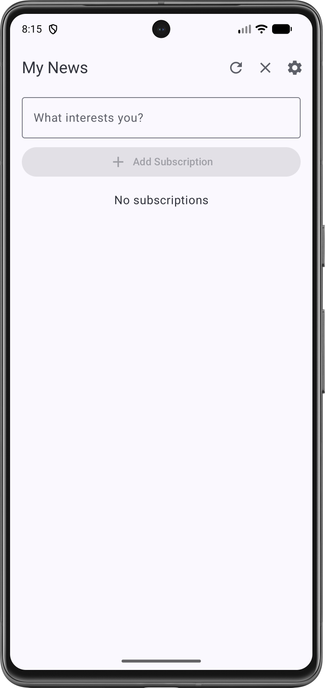 | 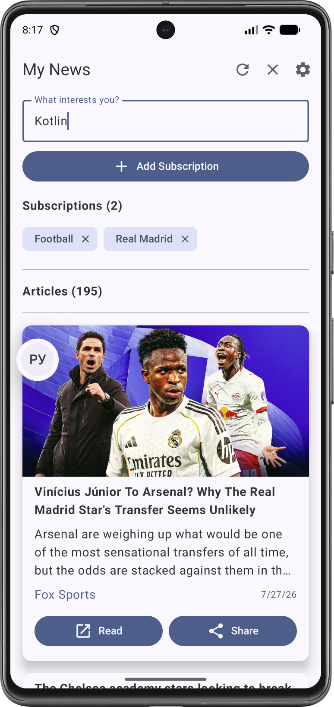 | 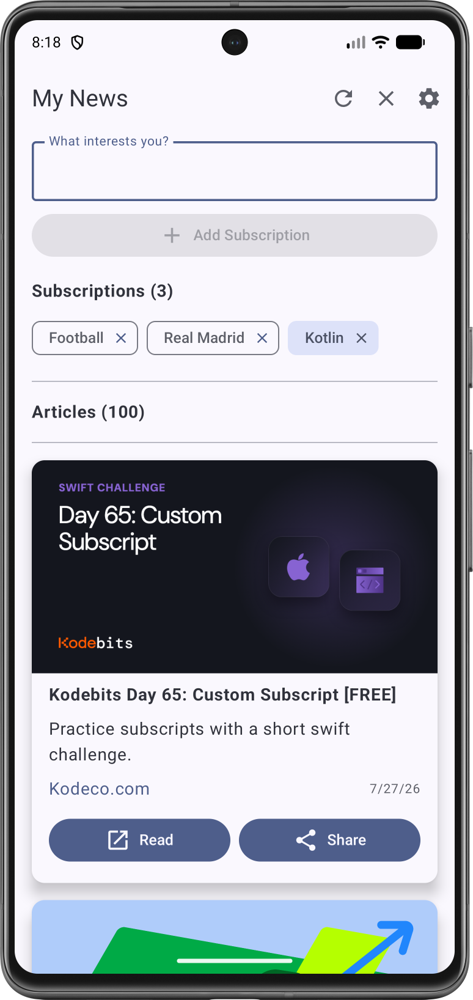 |

| Экран настроек | Очистка статей | Запрос разрешения |
| :----------------: | :-------------------: | :------------: |
| 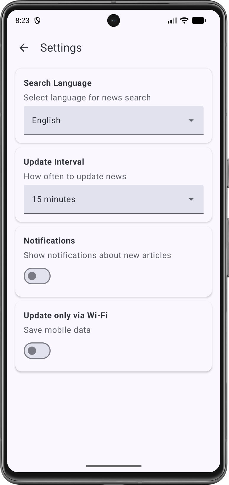 | 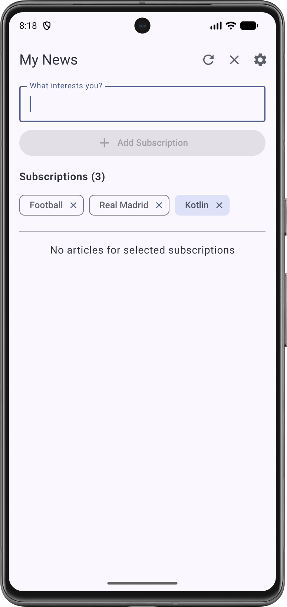 | 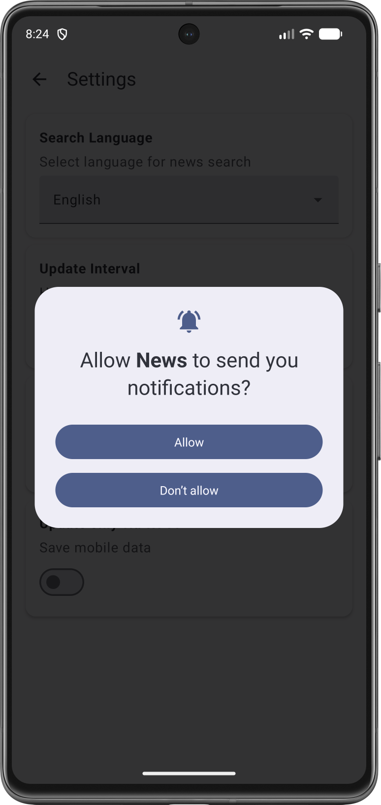 |

| Выбор интервала | Уведомление | Поделиться статьей |
| :----------------: | :-------------------: | :------------: |
| 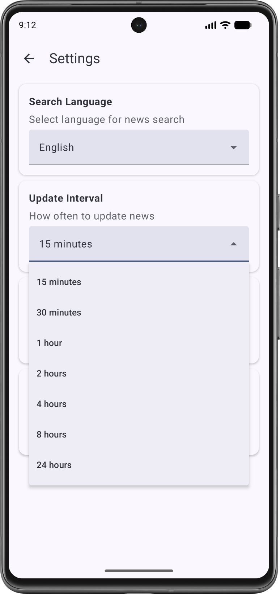 | 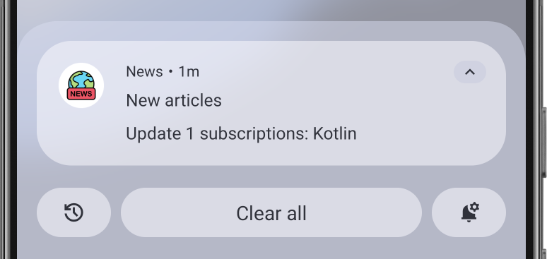 | 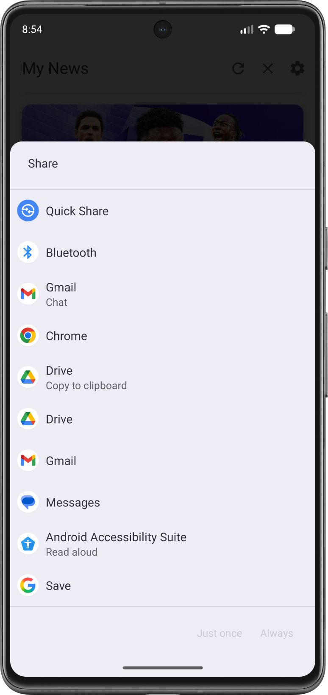 |

| Выбор языка | Иконка приложения | Открытие статьи |
| :----------------: | :-------------------: | :------------: |
| 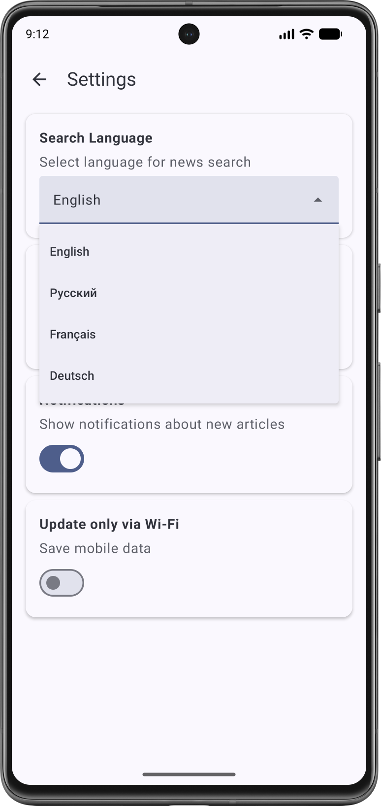 | 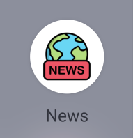 |  |

---

## 🛠 Технологии и инструменты

*   **Язык:** Kotlin
*   **Архитектура:** MVVM + Clean Architecture
*   **UI:** Jetpack Compose
*   **Фоновые задачи:** WorkManager
*   **Локальное хранилище:** Room + DataStore
*   **Сеть:** Retrofit
*   **DI:** Hilt

---

## 🚀 Быстрый старт

1. Перейдите в раздел [**Releases**](https://github.com/kerikir/NewsStepik/releases) этого репозитория.
2. Скачайте последнюю версию APK-файла (`News.apk`).
3. **Установка на устройство Android:**
   - Откройте загруженный файл.
   - Если потребуется, разрешите установку из неизвестных источников:  
     `Настройки → Безопасность → Неизвестные источники` (включите переключатель) и повторите попытку.
   - Следуйте инструкциям на экране до завершения.
4. Запустите приложение с иконкой на рабочем столе.

---

## ⚙️ Использование

При первом запуске:

- Ввести название темы в форму ввода и нажать кнопку добавление темы.  
- Приложение сразу загрузит статьи по вашим подпискам.

**Основные сценарии:**
| Действие | Как выполнить |
|----------|---------------|
| **Удалить неинтересную тему** | Перейдите на главный экран, нажать на крестик на против названия темы. |
| **Временно скрыть тему из ленты** | На главном экране нажать на форму темы. Она останется в подписках, но статьи по ней не будут показываться в общей ленте. |
| **Сменить язык статей** | Откройте «Настройки» (шестерёнка) → «Язык поиска». Выберите нужный язык, и статьи начнут подбираться на нём. |
| **Настроить автообновление** | «Настройки» → «Изменить интервал». Задайте интервал (15, 30, 60 минут) или включите обновление только по Wi-Fi. |
| **Управлять уведомлениями** | «Настройки» → «Уведомления». Можно оповещения или полностью отключить их. |
| **Ручное обновление ленты** | На главном экране нажать кнопку «Обновления». |
| **Открыть статью в браузере** | Нажмите на кнопку «Чтение» на карточке статьи и выберите «Открыть в браузере». |
| **Поделиться статьёй** | Нажмите на кнопку  «Поделиться» на карточке статьи и выберите приложение-получатель. |

При поступлении новых статей, соответствующих вашим подпискам, вы получите push-уведомление. Нажмите на него, чтобы сразу открыть статью.
